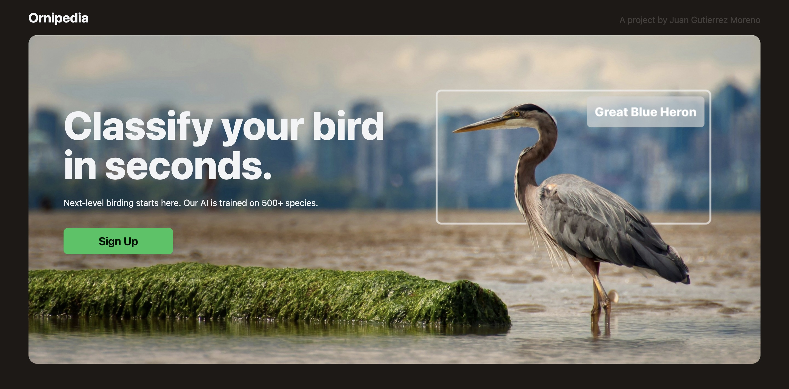
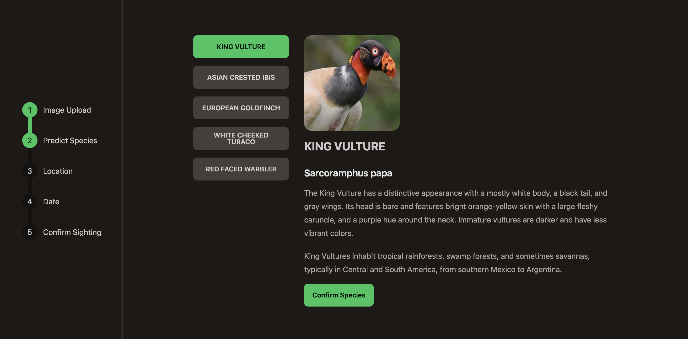
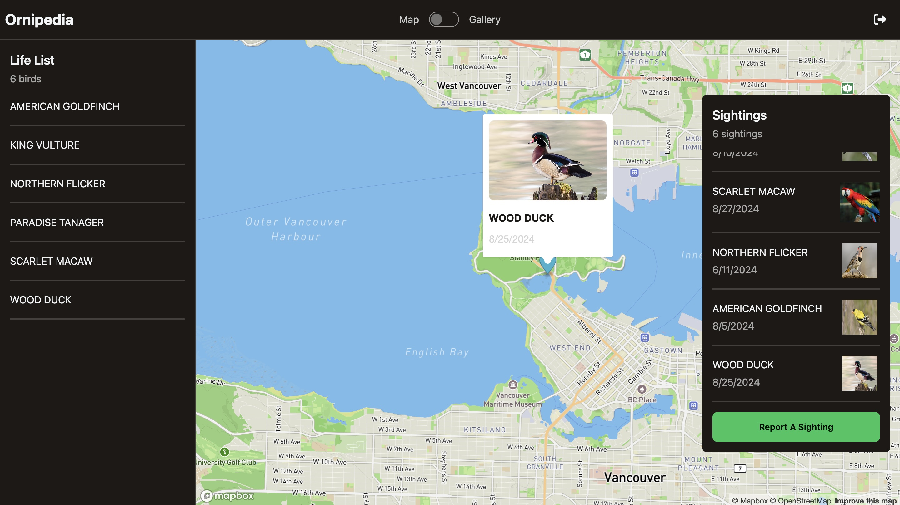
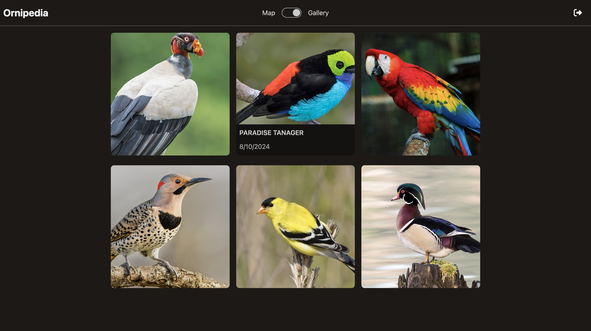

# Ornipedia - AI Bird Image Classification and Sighting Tracker

## About This Project

### Developers
- Juan Josue Gutierrez Moreno

### Description
Ornipedia is an AI-powered bird classification and sighting tracker designed to help bird enthusiasts identify bird species from photos and log their sightings. Leveraging machine learning and interactive maps, Ornipedia offers an intuitive user experience for casual and serious birdwatchers.

You can find the live demo website here [Ornipedia](https://ornipedia.vercel.app/).

### Preview
Identification Flow
---

The identification flow guides users through uploading an image, confirming the predicted species, selecting the location, and reviewing their sightings before submission.

Dashboard
---

The dashboard provides a comprehensive overview of logged sightings, with species details, locations, and dates.

Gallery
---

The gallery showcases all sighted birds with corresponding images, offering users an engaging way to explore their birdwatching history.

### Built With

- React - For building the front-end user interface.
- Tailwind CSS - To streamline styling and ensure responsiveness.
- DaisyUI - For pre-styled UI components, enhancing the design.
- Flask - As the backend framework, handling API requests and ML model integration.
- Supabase - For user authentication and managing the bird sightings database.
- TensorFlow - Powering the AI model for bird species classification.

## Road Map

- [ ] Improve Mobile Support - Enhance responsiveness and usability on mobile devices.
- [ ] Allow File Submissions - Enable users to upload images directly from their device rather than relying on URLs.
- [ ] Improve Model Accuracy - Retrain the model with a larger and more diverse dataset to enhance prediction accuracy.
- [ ] Manual Species Entry and Lookup - Allow users to manually enter species data and search for species information.
- [ ] Improve Identification Flow - Further streamline the user experience during the bird identification process.

## Demo Account
For your convenience, you can use this account to test out the application.
- Email: demo-user@demo.ca Password: 111111

## Links
- [Live Demo](https://ornipedia.vercel.app/)
- [LinkedIn](https://www.linkedin.com/in/juangutierrez/)
